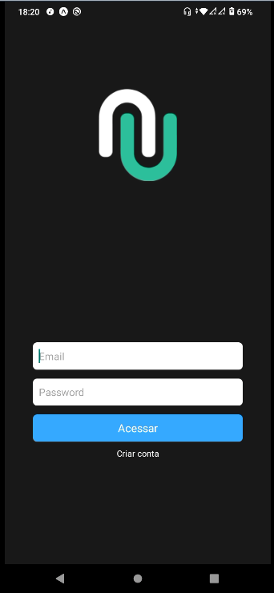

<p align="center">
  

  

  <a href="https://expo.io/">
    
  </a>

  <a href="https://reactnavigation.org/">
    
  </a>

  <a href="https://www.typescriptlang.org/">
    
  </a>

  
</p>

## 🖥 Preview

<div align="center">
  
</div>

## :bulb: About Project

Using  <span style="color:deepskyblue; font-weight:bold;">React Native</span> with **Expo** and <span style="color:darkslateblue; font-weight:bold;">Typescript</span> to make **application LoginApp**, this app was developed for my learning of React Native and **context API**

## :gear: Getting Started

```Bash
# Install dependencies
yarn install

# Run application
yarn start
```

## 🚀 Technologies used

The project is developed using the following technologies:
- [Expo](https://expo.io/)
- [Expo Google Fonts](https://github.com/expo/google-fonts)
- [React Native](https://reactnative.dev/)
- [React Navigation](https://reactjs.org/)